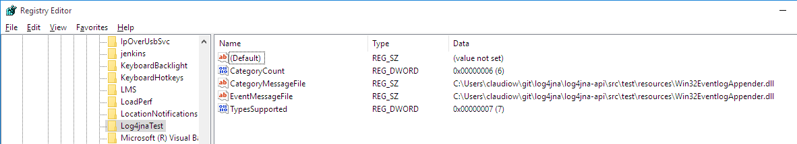
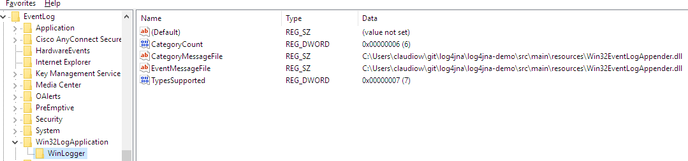

# Setting up your development environment

The first time you run the test suite or any application using Log4JNA, Log4JNA attempts to write the necessary entries in 
WindowsTM Registry. If you don't have administrator privileges the run fails.

### Running the tests
In order for the tests to pass you must run them as Administrator or set up the registry before your first run.

Open a command window as administrator and execute `mvn test`

If you are using an IDE launch it as Administrator import the Maven projects and run the tests. 

### IDE Setup

Please be careful and do not check IDE configuration files into GitHub, you can add the project to your IDE following the instructions bellow.

Eclipse configuration files are already added to `.gitignore`, please add any configuration file created by your IDE to the ignore file.

#### Eclipse
See [this article](https://books.sonatype.com/m2eclipse-book/reference/creating-sect-importing-projects.html) to import the Maven projects.

#### IteliJ IDEA
See [this article](https://www.jetbrains.com/help/idea/2016.1/importing-project-from-maven-model.html) to import the Maven projects.

#### NetBeans
See [this article](http://wiki.netbeans.org/MavenBestPractices) to import the Maven projects.

### Set up the Registry manually
#### For Log4JNA Api Tests

The `Win32EventlogAppender.dll` file is provided in the source as a test asset in
`<project-location>/log4jna-api/src/test/resources`

The tests configure Log4J programmatically and write into `Event Viewer-->Windows Logs-->Application`

1. Open `regedit` and browse to `HKEY_LOCAL_MACHINE\SYSTEM\CurrentControlSet\Services\EventLog\Application\`
2. Right click and select `New Key`, name it `Log4jnaTest` 
3. Add the following entries to `HKEY_LOCAL_MACHINE\SYSTEM\CurrentControlSet\Services\EventLog\Application\Log4jnaTest`

| Entry name          | Entry Type | Value                                    |
| ------------------- | ---------- | ---------------------------------------- |
| TypesSupported      | DWORD (32 bit) Value (REG_DWORD) | 0x7                                      |
| CategoryCount       | DWORD (32 bit) Value (REG_DWORD) | 0x6                                      |
| EventMessageFile    | String Value         (REG_SZ)    | &lt;Full path to&gt;\Win32EventlogAppender.dll |
| CategoryMessageFile | String Value         (REG_SZ)    | &lt;Full path to&gt;\Win32EventlogAppender.dll |

The registry should look like this:

#### For the Demo Application Tests
The `Win32EventlogAppender.dll` and Log4J 2 configuration files are provided in the source as an application asset in
`<project-location>/log4jna-demo/src/main/resources`

The default Log4J configuration is `log4j2.xml` and writes into `Event Viewer-->Application and Service Logs-->Win32LogApplication` 

1. Open `regedit` and browse to `HKEY_LOCAL_MACHINE\SYSTEM\CurrentControlSet\Services\EventLog\`
2. Right click and select `New Key`, name it `Win32LogApplication`
  1. Add another key to `HKEY_LOCAL_MACHINE\SYSTEM\CurrentControlSet\Services\EventLog\Win32LogApplication`, name it `WinLogger` 
3. Add the following entries to `HKEY_LOCAL_MACHINE\SYSTEM\CurrentControlSet\Services\EventLog\Win32LogApplication\WinLogger`

| Entry name          | Entry Type | Value                                    |
| ------------------- | ---------- | ---------------------------------------- |
| TypesSupported      | DWORD (32 bit) Value (REG_DWORD) | 0x7                                      |
| CategoryCount       | DWORD (32 bit) Value (REG_DWORD) | 0x6                                      |
| EventMessageFile    | String Value         (REG_SZ)    | &lt;Full path to&gt;\Win32EventlogAppender.dll |
| CategoryMessageFile | String Value         (REG_SZ)    | &lt;Full path to&gt;\Win32EventlogAppender.dll |

The registry should look like this:

