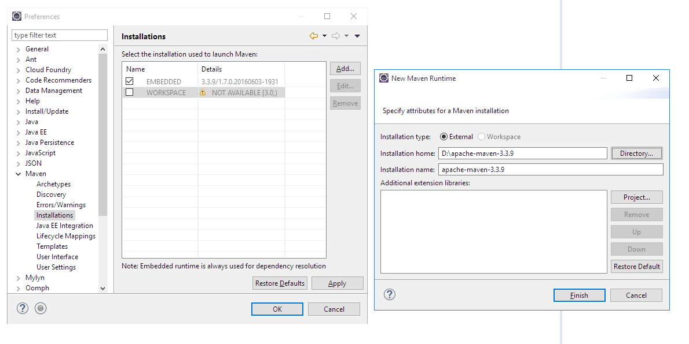
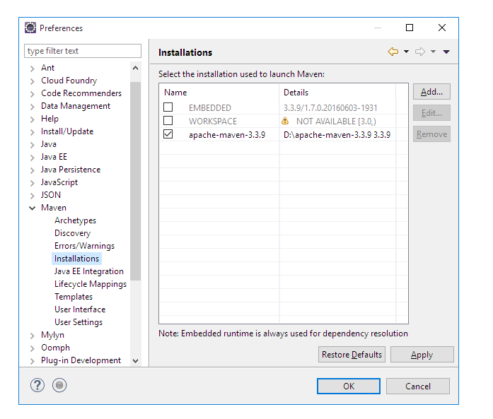
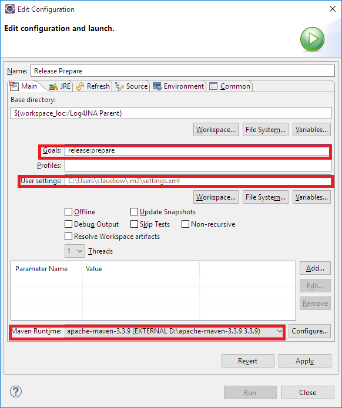
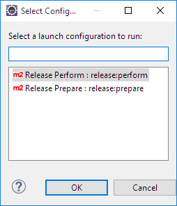

# Manual Release To Maven Central

## <a name="toc"></a>Table of Content
- [Introduction](#intro)
- [Notes on Building with Maven](#notes)
- [One-Time Release Setup](#onetime)
  - [GPG](#gpg)
  - [Sonatype OSS Repositories](#oss)
  - [GitHub](#gihub)
  - [seetings.xml](#settings)
- [Deploying Snapshots](#snap)
- [Releasing to Maven Central](#mvncent)
  - [release:prepare](#reprep)
  - [release:perform](#reperf)
  - [Command Line Release](#cmd)
  - [Eclipse](#eclipse)
    - [Configuring Eclipse](#confecl)
    - [Release From Eclipse](#relecl)
- [Move from Staging to Central](#movcent)
- [After Release Tasks](#after)
- [Roll Back a Release Before Fixing Problems](#rollback)

________  

## <a name="intro"></a>Introduction

This is a guide for Log4JNA developers hoping to publish a release to Maven Central.  It summarizes the high-level process and requirement 
relevant to Log4JNA, but does not go into details about particular tools, as there are other documentation sources that are more relevant 
for that.  The majority of this document is based on the [Sonatype OSS Maven Repository Usage Guide][OSSGuide].

Log4JNA is a Windows project, therefore it should be built and tested in Windows environments. Although it is possible to develop and build 
Log4JNA in non-Windows environments, this procedure is discouraged for distribution builds. Documentation on building on non-Windows 
environments and skipping testing is covered elsewhere in the project documentation.

We use Maven profiles to perform different tasks for different purposes like local build, snapshot build and release builds. 

We use the maven-release-plugin to release to Maven Central via Sonatype's SSO staging repository.

In order to build a release there are several software and configuration requisites and you have to run the build as administrator.

[TOC](#toc)
________  

## <a name="notes"></a>Notes on Building with Maven

In order to build with [Maven][], you'll need Java 8+ and [Maven][] 3.3.9+.  

Download and install them, and then run `mvn --version` to check that it's working.  

If you don't already have it, also get Git and a clone of the Log4JNA repository using a ssh connection `git clone git@repo.cgtca.ca:live-projects/log4jna.git`. See [One-Time Release Setup](#onetime) for ssh requirements.  

Once you have this, run `mvn clean package` in the `log4jna` directory.  This command compiles, unit tests, and JARs all of the Log4JNA 
components that are currently Maven enabled.

For local testing, you can use `mvn install`.  This packages the components and installs the resulting JARs into 
`%USERPROFILE%\.m2\repository\org\dblock\log4jna`, but doesn't publish them anywhere else.  For more information on building software with 
Maven, see the [Running Maven](http://maven.apache.org/run-maven/index.html).

[TOC](#toc)
________  

## <a name="onetime"></a>One-Time Release Setup

In order to perform Maven releases, there's some extra steps needed beyond what's needed to build Log4JNA.

### <a name="gpg"></a>GPG

First, make sure you have a [GPG][] client installed and on your command-line path. 

If you have GIT installed there is a GPG executable installed in %ProgramFiles%\Git\usr\bin.

On windows use `where gpg` to see if it is in the PATH. On Linux use `which gpg`.

If you do not have GPG installed we recommend that you update GIT to the latest release.

Alternative you can install GPP for Windows.

#### GPG Keys

The `log4jna-build` subproject contains the public and private keys used by the Log4JNA project.

These keys are encrypted using the AppVeyor **secure-file** utility.

1. Decrypt the public key file running `<secure-file-install-dir>\tools\secure-file -decrypt <log4jnapublic.pgp.asc.enc> -secret <keyphrase> -out [log4jnapublic.pgp.asc]`
2. Decrypt the private key file running `<secure-file-install-dir>\tools\secure-file -decrypt <log4jnasecret.pgp.asc.enc> -secret <keyphrase> -out [log4jnasecret.pgp.asc]`
3. Import public keys by running `gpg --import log4jnapublic.pgp.asc` 
4. Import public keys by running `gpg --import log4jnasecret.pgp.asc`, this may require the `--allow-secret-key-import` switch if you have and old version of GPG.

If you don't have access to the encryption password, you can create a [GPG][] key pair and distribute your public key to hkp://pool.sks-keyservers.net/.  
See [How To Generate PGP Signatures With Maven](http://central.sonatype.org/pages/working-with-pgp-signatures.html) for more information.

[TOC](#toc)
________  

### <a name="oss"></a>Sonatype OSS Repositories

Log4JNA has a deployment account in Sonatype OSS called Lo4JNACI, there are default configurations for that account in the encrypted settings.xml
files in the `log4jna-build` sub project.

If you don't have access to the encryption password follow this instructions:
 
Get access to the Sonatype OSS repositories.  This is covered as steps 2-3 in the [Sonatype OSS Maven Repository Usage Guide][OSSGuide].  
The correct groupId to use is "org.dblock.log4jna".

After you have your account all set up, configure your Maven settings.xml (generally in a .m2 directory within your user home directory) 
like this (pulled from [Sonatype OSS Maven Repository Usage Guide][OSSGuide] section 7a.1):

```xml
<settings>
  ...
  <servers>
    <server>
      <id>sonatype-nexus-snapshots</id>
        <username>your-jira-id</username>
        <password>your-jira-pwd</password>
    </server>
    <server>
      <id>sonatype-nexus-staging</id>
        <username>your-jira-id</username>
        <password>your-jira-pwd</password>
    </server>
  </servers>
  ...
</settings>
```

[TOC](#toc)
________  

### <a name="github"></a>GitHub

First, follow this link and get yourself setup with ssh on github first [github-ssh-keys].  If ssh-add does not work and fails 
with error 'Could not open a connection to your authentication agent' but the agent looks right, enter 'eval $(ssh-agent)', then try the ssh-add again.

Set your key in 'settings.xml'

```xml
<settings>
  ...
  <servers>
    <server>
      <id>github.com</id>
      <privateKey>${user.home}\.ssh\id_rsa</privateKey>
      <passphrase>{LG8m3fLb8fIHD6p43zAj98QB2luBf+3Xci7p12DvUDs=}</passphrase>
    </server>
  </servers>
  ...
</settings>
```

[TOC](#toc)
________  

### <a name="settings"></a>seetings.xml

The `log4jna-build` subproject contains the `setngs.xml` and 'setings-security' files used by the Log4JNA project.

These files are encrypted using the AppVeyor **secure-file** utility.

1. Decrypt the settings.xml file running `<secure-file-install-dir>\tools\secure-file -decrypt <settings.xml.enc> -secret <keyphrase> -out [settings.xml]`
2. Decrypt the settings-security.xml file running `<secure-file-install-dir>\tools\secure-file -decrypt <settings-security.xml.enc> -secret <keyphrase> -out [settings-security.xml]`
3. Change the server configuration in the settings.xml file to match your Sonatype OSS and GitHub configuration
4. Copy or merge the files into `%USERPROFILE%\.m2` folder.
4. If there is more than one master key in the settings-security.xml. Comment the existing key to use the Log4JNA one. 

Alternatively you can use Maven -settings parameter to point to a different settings file location: 

`mvn --settings YourOwnSettings.xml clean install` or `mvn -s YourOwnSettings.xml clean install`

[TOC](#toc)
________  

## <a name="snap"></a>Deploying Snapshots

Snapshot versions allow sharing the under development (not yet released) code.  These versions may change over time (unlike released versions) 
and are not published to Maven Central.  To use a snapshot version, a user will need to configure their build tool to use the correct 
snapshots repository, which in this case is `https://oss.sonatype.org/content/repositories/snapshots/`.  See the 
[POM Syntax](http://www.sonatype.com/books/mvnref-book/reference/pom-relationships-sect-pom-syntax.html) from Maven: The Complete Reference for more information.

To publish a snapshot:

1. Open a command window as administrator.
2. Run `vcvarargs[all | 32 | 64] from your Visual C installation folder.
3. Run `mvn -B clean deploy -P deploy`.  See section 7a.2 of the [Sonatype OSS Maven Repository Usage Guide][OSSGuide] for more information.

See the Eclipse section [bellow](#eclipse) to run from your Eclipse IDE.

[TOC](#toc)
________  

## <a name="mvncent"></a>Releasing to Maven Central

We use the [`maven-release-plugin`][maven-release-plugin] to build and release to Maven Central. 

Maven Release Plugin, is rather complex.  By default it will prompt you for various information related to the release, modify the POM files 
to update the version, and perform Git operations on your behalf.  It is recommended to read its documentation before proceeding, and 
consider doing a dry run (as documented in the [usage page](http://maven.apache.org/plugins/maven-release-plugin/usage.html)) before 
proceeding with the actual release.

We have configured our `pom.xml` file to simplify the process and avoid all prompts which is accomplish by running Maven in batch mode.

Performing a release is a 2 step process accomplishes by 2 different goals in the plugin `releas:prepare` and `release:perform`. You must run
Maven on the top directory of the project, normally **log4jna** unless you indicated it different when cloning from GitHub.

[TOC](#toc)
________  

### <a name="repre"></a>release:prepare

Assuming that the current projects pom.xml files look like this:

Parent project:
```xml
<project ...
  <groupId>org.dblock.log4jna</groupId>
  <artifactId>log4jna</artifactId>
  <version>2.0-SNAPSHOT</version>
  <packaging>pom</packaging>
  <name>Log4JNA Parent</name>
  ...
</project>
```

Sub projects:
```xml
<project ...
  <artifactId>log4jna-api</artifactId>
  <name>Log4JNA Api</name>
  <description>Logger appender implementation to Write to Windows Event Logger.</description>
  <url>https://github.com/dblock/log4jna</url>
  <parent>
    <groupId>org.dblock.log4jna</groupId>
    <version>2.0-SNAPSHOT</version>
    <artifactId>log4jna</artifactId>
    <relativePath>../</relativePath>
  </parent>
  ...
</project>
```

Executing `mvn -B release:prepare` will perform the following tasks:

1. Verify that there are no local modifications to commit to GitHub. 
2. Update the `pom.xml` files in all projects by eliminating the `-SNAPSHOT` on the versions.
  1. Create a backup copy of all `pom.xml` files and some temporal release files (We have them included in .gitignore). 
  2. In the parent project the **project version** is changed from `<version>2.0-SNAPSHOT</version>` to: `<version>2.0</version>`
  3. In the sub projects: 
    1. The **parent version** is changed from `<version>2.0-SNAPSHOT</version>` to: `<version>2.0</version>`
    2. Dependencies on Log4JNA are updated from `<version>2.0-SNAPSHOT</version>` to: `<version>2.0</version>`
3. For each project execute the goals `clean verify`.
  1. Delete the `target` directory.
  2. Run all tests.
4. Check in all modified `pom.xml` files into yor local Git repository and GitHub.
5. Create a tag named **log4jna-2.0** (or whatever version you are building).
6. Update all `pom.xml` to the next SNAPSHOT version.
  1. In the parent project the **project version** is changed from `<version>2.0</version>` to: `<version>2.1-SNAPSHOT</version>`
  2. In the sub projects: 
    1. The **parent version** is changed from `<version>2.0</version>` to: `<version>2.1-SNAPSHOT</version>`
    2. Dependencies on Log4JNA are updated from `<version>2.0</version>` to: `<version>2.1-SNAPSHOT</version>`
7. Check in all modified `pom.xml` files into yor local Git repository and GitHub.

[TOC](#toc)
________  

### <a name"reperf"></a>release:perform

By default `release:perform` runs two main goals `deploy` and `site:deploy`, we have modified this in Log4JNA parent pom.xml to deploy
the site to GitHub gh-pages branch by means of the scm-publish-plugin.

```xml
<project ...
  ...
  <build>
  ...
    <plugins>
    ...
      <plugin>
        <groupId>org.apache.maven.plugins</groupId>
        <artifactId>maven-release-plugin</artifactId>
        <configuration>
          <releaseProfiles>release</releaseProfiles>
          <goals>deploy scm-publish:publish-scm</goals>
        </configuration>
      </plugin>
    </plugins>
    ...
  </build>
  ...
  <profiles>
  ...
    <profile>
      <id>release</id>
      <build>
        <plugins>
        ...
          <!-- During site deploy we publish to GitHub -->
          <plugin>
            <groupId>org.apache.maven.plugins</groupId>
            <artifactId>maven-scm-publish-plugin</artifactId>
            <version>1.1</version>
            <inherited>false</inherited>
            <configuration>
              <serverId>github.com</serverId>
              <scmBranch>gh-pages</scmBranch>
              <pubScmUrl>${project.scm.developerConnection}</pubScmUrl>
            </configuration>
          </plugin>
          ...
        </plugins>
      </build>
    </profile>
  </profiles>
  ...
</project>
``` 

We also force the creation of the `site:stage` before packaging to include the site documentation in the log4jna-assembly subproject.

```xml
<project ...
  ...
  <build>
  ...
    <plugins>
    ...
      <!-- Site general configuration -->
      <!-- We prepare the Site before hand to add it to the assembly docs directory -->
      <plugin>
        <artifactId>maven-site-plugin</artifactId>
        <executions>
          <execution>
            <phase>prepare-package</phase>
            <goals>
              <goal>site</goal>
              <goal>stage</goal>
            </goals>
          </execution>
        </executions>
      </plugin>
    </plugins>
    ...
  </build>
  ...
</project>
```

Executing `mvn -B release:perform` will perform the following tasks:

1. Clone the tag created in prepare from GitHub into `target\checkout`
2. Execute the goal `deploy` in all projects.
  1. Compile and test all projects.
  2. Sign all pom.xml, jar, and zip files with the GPG keys.
  3. Deploy all pom.xml, jar, and zip files to Sonatype's staging repository.
3. Execute the goal `publish-scm` in the parent project.
  1. Clone the branch gh-pages from GitHub into `target\checkout\target\scmpublish-checkout`
  2. Update the branch with the content of `target\checkout\target\staging`
  3. Checkin and Push the modified `target\checkout\target\scmpublish-checkout`

[TOC](#toc)
________  

### <a name="cmd"></a>Command Line Release

1. Open a command window as administrator.
2. Run `vcvarargs[all | 32 | 64].bat from your Visual C installation folder.
3. Run `mvn -B release:prepare`.
4. Run `mvn -B release:perform`.

[TOC](#toc)
________  

### <a name="eclipse"></a>Eclipse

Eclipse requires configuration in order to run the release-plugin. Eclipse internal maven implementation is not in the %PATH% and because 
the release plugin forks Maven tasks Maven fails to find Maven ;-).

Assuming that you have installed Maven, Git and GPG the following instructions will work.

#### <a name="confecl"></a>Configuring Eclipse

##### Add the external Maven installation to Eclipse

1. Run Eclipse and Click on the Window --> Preferences menu.
2. In the left panel of the Preferences dialog find Maven and Expand it.
3. Click on Maven --> Installations.
4. In the right panel dialog click on Add.
5. In the New Maven Runtime dialog select the external radio button and click on Directory.
6. In the Maven Installation dialog navigate to your Maven installation folder and click Ok.
7. In the New Maven Runtime click on Finish.
 
8. In the right panel dialog check the newly added installation to be the one run.


##### Configure Maven Run

1. Open a command window as administrator.
2. Run `vcvarargs[all | 32 | 64].bat from your Visual C installation folder.
3. Run Eclipse from the command window `<eclipse-intall-dir>\eclipse.exe`
4. Right click on the Log4JNA Parent project and Click on Run As --> Maven Build...
5. On the Run Dialog 
 
  1. Enter a meaningful name
  2. On the Goals field enter `release:prepare`
  3. Verify that User Setting field points to the desired file.
  4. Verify that Maven Runtime drop down points to the external maven installation.
  5. Click Apply.
6. Right click on the Log4JNA Parent project and Click on Run As --> Maven Build...
7. On the Run Dialog 
  1. Enter a meaningful name
  2. On the Goals field enter `release:perform`
  3. Verify that User Setting field points to the desired file.
  4. Verify that Maven Runtime drop down points to the external maven installation.
  5. Click Apply.
8. Optionally repeat the previous steps for `release:rollback` and `release:clean` 

[TOC](#toc)
________  

#### <a name="relecl"></a>Release From Eclipse

 
 
1. Open a command window as administrator.
2. Run `vcvarargs[all | 32 | 64].bat from your Visual C installation folder.
3. Run Eclipse from the command window `<eclipse-intall-dir>\eclipse.exe`
4. Right Click on the Log4JNA Parent project and Click on Run As --> Maven Build
  1. On the Select Configuration dialog choose Relese Prepare
5. Right Click on the Log4JNA Parent project and Click on Run As --> Maven Build
  1. On the Select Configuration dialog choose Relese Perform

[TOC](#toc)
________  

### <a name="movcent"></a>Move from Staging to Central
Once you've succeeded in building and deploying to the staging repository, log in to [Sonatype OS](https://oss.sonatype.org/), and perform the following steps.

*   Go to [Staging Repositories](https://oss.sonatype.org/index.html#stagingRepositories).
*   Select the staging repository at the bottom that was created by the release process, it should have a `com.dblock.log4jna` profile.
*   Click the *Close* button in the toolbar. This should take a bit of time to complete, you may need to *Refresh*.
*   If there are any problems reported, fix them.
*   Click on the closed staging repository.
*   Examine the *Content* tab. Right click on artifacts to download them.
*   Test the downloaded artifacts to make sure that the contents of the staging repository are what you want to release.
*   Click the *Release* button in the toolbar.
*   If there are any problems reported, fix them.
*   The release should now be in the *Releases* repository.
*   For projects that have Maven Central synchonization enabled, their artifacts in the *Releases* repository are synched to Maven Central every two hours. The *very first time* the Log4JNA project published required a comment on the setup JIRA ticket to get synch enabled.

[TOC](#toc)
________  

## <a name="after"></a>After Release Tasks

Once the release is completed there are a few changes needed in the documentation.

Update the root `README.md` and the site/markdown/README.md` download sections to reflect the next release version number. Ie. if the release was 2.0 change them to 2.1

Change:

```md
## <a name="dw"></a>Downloads
#### Log4JNA 2 for Log4j 2.x

| Current Release | Latest Develpment |
| ------------- |------------- |
| [Log4jna Api 2.0](https://repository.sonatype.org/service/local/artifact/maven/redirect?r=central-proxy&g=org.dbloc.log4jna&a=log4jna-api&v=RELEASE&e=jar) | [Log4JNA Api 2.0-SNAPSHOT](https://oss.sonatype.org/service/local/artifact/maven/redirect?r=snapshots&g=org.dblock.log4jna&a=log4jna-api&v=LATEST&e=jar) |
| [Log4jna Demo 2.0](https://repository.sonatype.org/service/local/artifact/maven/redirect?r=central-proxy&g=org.dbloc.log4jna&a=log4jna-demo&v=RELEASE&e=jar) | [Log4JNA Demo 2.0-SNAPSHOT](https://oss.sonatype.org/service/local/artifact/maven/redirect?r=snapshots&g=org.dblock.log4jna&a=log4jna-demo&v=LATEST&e=jar) |
| [Log4jna Demo with dependencies 2.0](https://repository.sonatype.org/service/local/artifact/maven/redirect?r=central-proxy&g=org.dbloc.log4jna&a=log4jna-demo&v=RELEASE&e=jar) | [Log4jna Demo with dependencies 2.0-SNAPSHOT](https://oss.sonatype.org/service/local/artifact/maven/redirect?r=snapshots&g=org.dblock.log4jna&a=log4jna-demo&v=LATEST&c=jar-with-dependencies&e=jar) |
| [Log4jna Zip (Jars, Sources, Dependencies and Documentation)](https://repository.sonatype.org/service/local/artifact/maven/redirect?r=central-proxy&g=org.dbloc.log4jna&a=log4jna-assembly&v=RELEASE&e=zip) | [Log4jna Zip (Jars, Sources, Dependencies and Documentation)](https://oss.sonatype.org/service/local/artifact/maven/redirect?r=snapshots&g=org.dblock.log4jna&a=log4jna-assembly&v=LATEST&e=zip) |

```

To:

```md
## <a name="dw"></a>Downloads
#### Log4JNA 2 for Log4j 2.x

| Current Release | Latest Develpment |
| ------------- |------------- |
| [Log4jna Api 2.1](https://repository.sonatype.org/service/local/artifact/maven/redirect?r=central-proxy&g=org.dbloc.log4jna&a=log4jna-api&v=RELEASE&e=jar) | [Log4JNA Api 2.1-SNAPSHOT](https://oss.sonatype.org/service/local/artifact/maven/redirect?r=snapshots&g=org.dblock.log4jna&a=log4jna-api&v=LATEST&e=jar) |
| [Log4jna Demo 2.1](https://repository.sonatype.org/service/local/artifact/maven/redirect?r=central-proxy&g=org.dbloc.log4jna&a=log4jna-demo&v=RELEASE&e=jar) | [Log4JNA Demo 2.1-SNAPSHOT](https://oss.sonatype.org/service/local/artifact/maven/redirect?r=snapshots&g=org.dblock.log4jna&a=log4jna-demo&v=LATEST&e=jar) |
| [Log4jna Demo with dependencies 2.1](https://repository.sonatype.org/service/local/artifact/maven/redirect?r=central-proxy&g=org.dbloc.log4jna&a=log4jna-demo&v=RELEASE&e=jar) | [Log4jna Demo with dependencies 2.1-SNAPSHOT](https://oss.sonatype.org/service/local/artifact/maven/redirect?r=snapshots&g=org.dblock.log4jna&a=log4jna-demo&v=LATEST&c=jar-with-dependencies&e=jar) |
| [Log4jna Zip (Jars, Sources, Dependencies and Documentation)](https://repository.sonatype.org/service/local/artifact/maven/redirect?r=central-proxy&g=org.dbloc.log4jna&a=log4jna-assembly&v=RELEASE&e=zip) | [Log4jna Zip (Jars, Sources, Dependencies and Documentation)](https://oss.sonatype.org/service/local/artifact/maven/redirect?r=snapshots&g=org.dblock.log4jna&a=log4jna-assembly&v=LATEST&e=zip) |

```
or whatever the next release number is.

[TOC](#toc)
________  

## <a name="rollback"></a>Roll Back a Release Before Fixing Problems

The release plugin can be quite tricky.  

Most of the problems come from configuration errors in the `pom.xml` or `settings.xml` file. Another source of problems are test failures.

Normally the release fails on the `relesase:prepare` stage and is easy to recover.

The best way to fix problems after a failed build is to execute `mvn release:rollback` to recover the previous state on all `pom.xml`.

One of the most common sources of problems after a roll back is that Maven does nothing with the tags created in the local Git repository and 
GitHub. You should delete the tags manually after rolling back.

Having the tags is extremely important when performing a release as if a major release happens and the **master branch** deviates and becomes 
non backwards compatible the only way of providing bug fixes for a a previous major version is deriving a branch from the tag of the last release.

To roll back, in a command window perform the following:

1. Run `mvn release:rollback` to recover the previous version of the pom.xml files and update them in the local Git repository and GitHub.
2. Run `mvn release:clean` to clean up any leftovers from the previous release run.
3. Delete the tags.
  1. Run`git tag` and identify the tag created by the latest release run.
  2. Run `git tag -d <tag-name>`
  3. Run `git push origin :refs/tags/<tag-name>`

Finding errors in Maven is quite difficult given the amount of INFO lines in Maven output, a solution to that is to run Maven in quiet mode,
 if needed you can run `mvn -B -q release:prepare` or `mvn -B -q release:perform` this will log only WARNING and ERROR messages to the console.

If worst comes to worst and release plugin fails but versions are all essentially flagged for release version.  Simply use this then follow 
the remainder of the release process.

   `mvn -B deploy scm-publish:publish-scm -P release`

After deployment in this case, make sure to set everything manually back to next snapshot release.

[TOC](#toc)
________  

[OSSGuide]: http://central.sonatype.org/pages/ossrh-guide.html
[Maven]: http://maven.apache.org/
[gpg]: http://www.gnupg.org/
[maven-release-plugin]: http://maven.apache.org/plugins/maven-release-plugin/
[github-ssh-keys]: https://help.github.com/articles/generating-ssh-keys/
